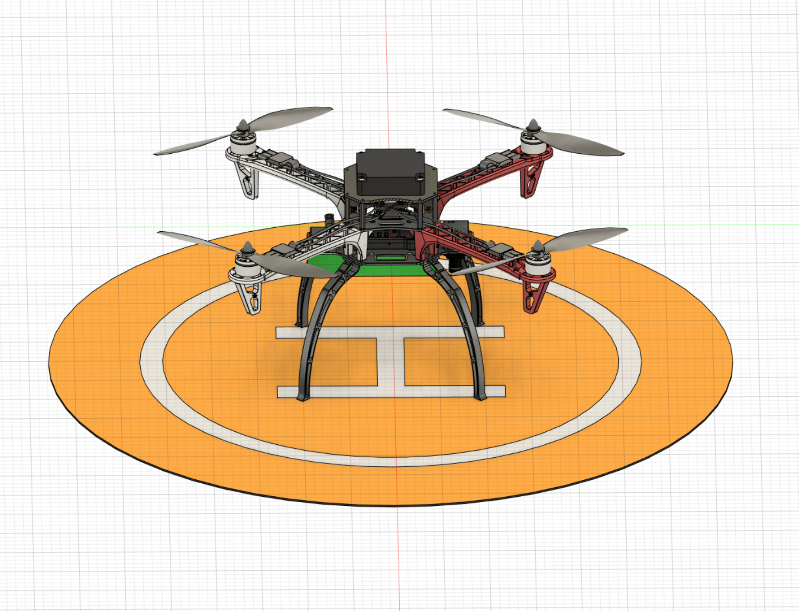

# Flamewheel F450
This folder contains the 3D CAD models and some information of the F450 precursor to the larger drone. The Fusion360 model contains all parts and sub-assemblies for the model which can also be exported in AutoCAD Inventor if needed. All 3D models are as close to the real thing as I could reasonably make them.

This is what the F450 looks like in a CAD model vs real life:

               

It is capable of cm-level accuracy using RTK positioning. [Here](https://logs.px4.io/plot_app?log=a1049153-6a2f-4792-a056-a510ce36dd62) is a log of a 60m altitude sortie and [this](https://logs.px4.io/plot_app?log=4bc50d28-8714-4083-88e1-ec528ad3f30e) is a log of a 40m altitude sortie both with extremely accurate positioning and stability.