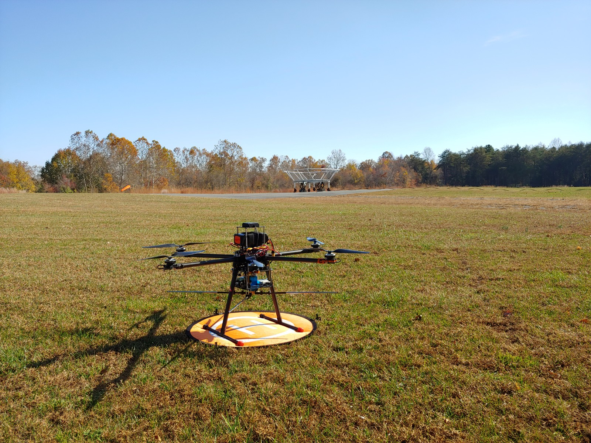
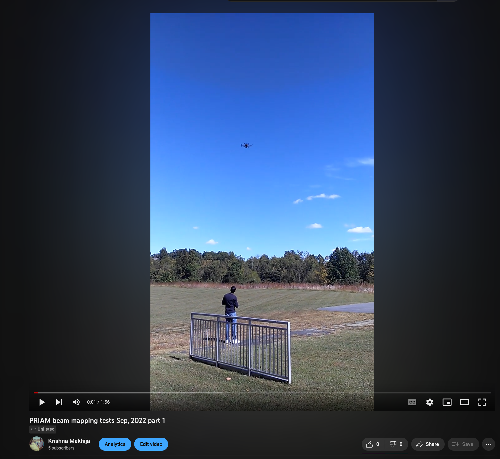
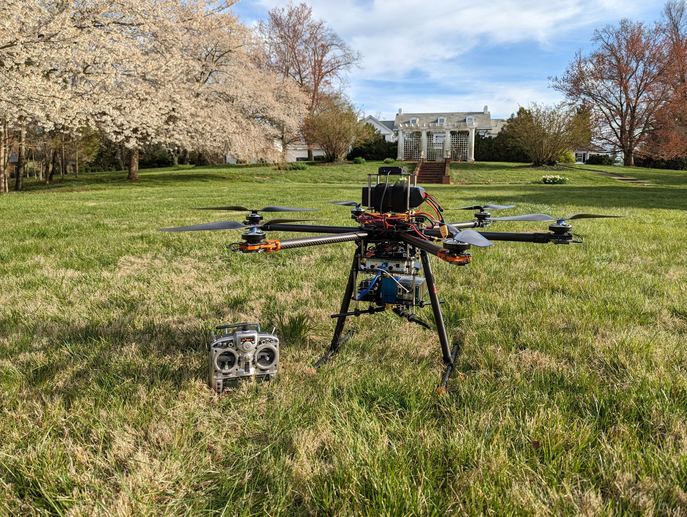

# PRIAM
This folder contains the 3D CAD model of the T960-frame based drone in Fusion360. All sub-assemblies and parts are included in the .f3z file. One can use that to create an AutoCAD Inventor export for further processing.

Here is a screenshot of what the drone's 3D model looks like (mag payload):

Here is a photo of the drone just before takeoff (Oct 2022):

Here is a video of PRIAM while calibrating the PAPER dipole (Sep, 2022):

")

In addition, there is a phase version of the drone. PRIAM-phase or PRIAM-p consists of the same drone but with a novel phase-capable payload which consists of a high accuracy frequency source and the Ettus Research B210 SDR. This version of the drone has not, as of writing this document, been tested on the field -- only on the bench. 

Here is a picture of PRIAM-p during hover tests. 

