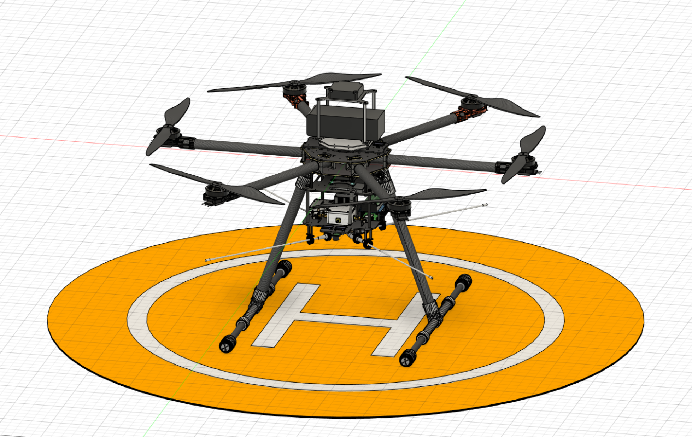

# PRIAM
This folder contains the 3D CAD model of the T960-frame based drone in Fusion360. All sub-assemblies and parts are included in the .f3z file. One can use that to create an AutoCAD Inventor export for further processing.

Here is a screenshot of what the drone's 3D model currently looks like:

Here is what it currently looks like (September 2020 build, not completely finished):

Here is a video from a previous flight (120m altitude):

