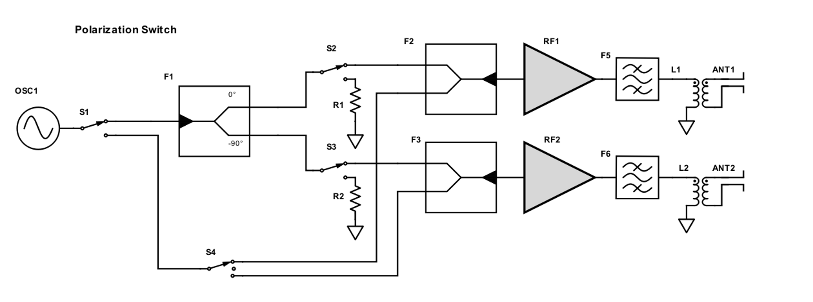
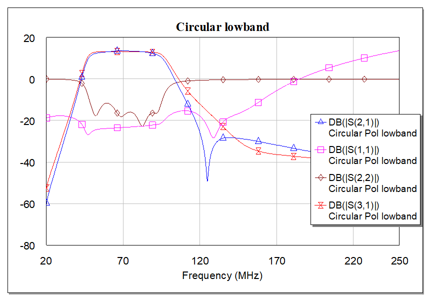
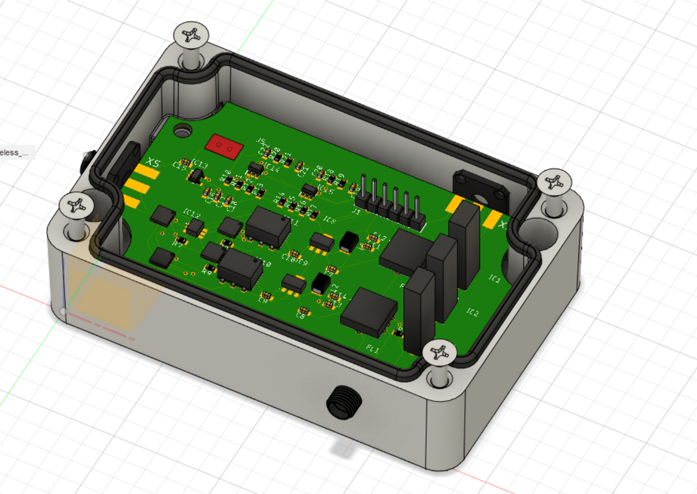
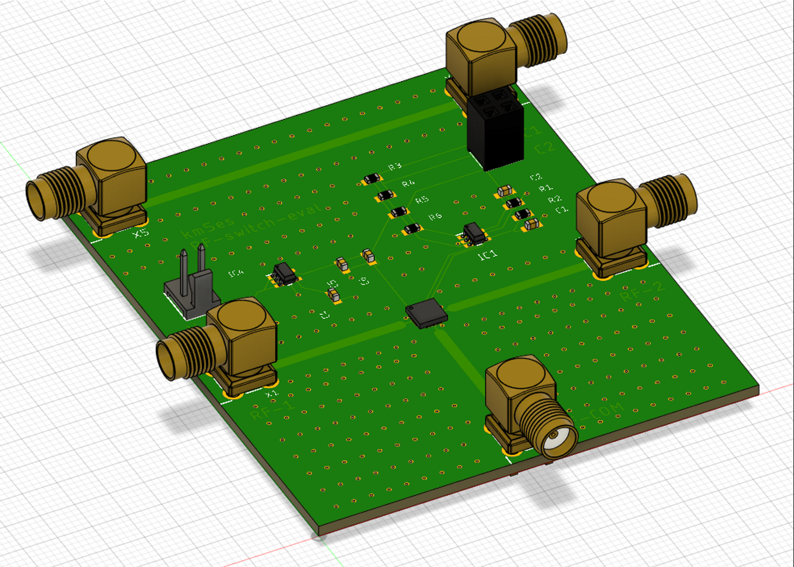

## RF-related files
This contains the MWO simulations and Eagle PCB files for the polarization switch and the evaluation switch for the drone project. The block diagram of the polarization switch is shown below:

There should be three circuit boards: for a low-band, mid-band, and a high-band mode. The purpose of this device is to enable one to make cross-polarization, co-polarization and circular polarization measurements of the antenna under test. In addition, it also provides some gain and filtering and can output up to 20 dBm of power. [This](pol_switch.emp) file has the MWO simulations of the low-band version of the polarization switch. Here are the S-parameters (simulation only) of the low-band switch in circular polarization mode:

The BOM (not comprehensive right now, does not contain Mini Circuits components) is attached [here](ShopCart.csv). The box that I have chosen to use to house the PCB is linked [here][hammond_box]. Eagle and Fusion360 
files soon to follow. This is what the boards look like right now (eval and full pol switch).

[hammond_box]: https://www.hammfg.com/part/1590Z062BK?referer=526

