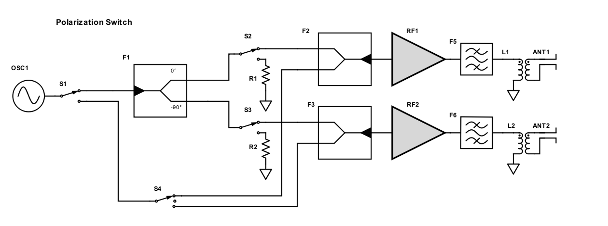
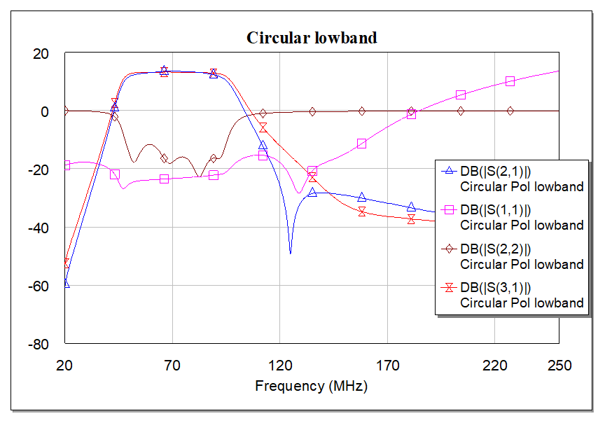
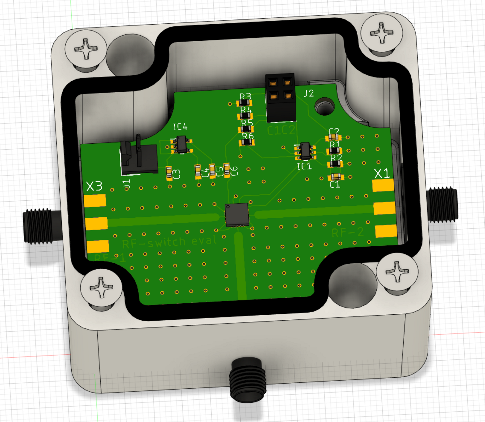
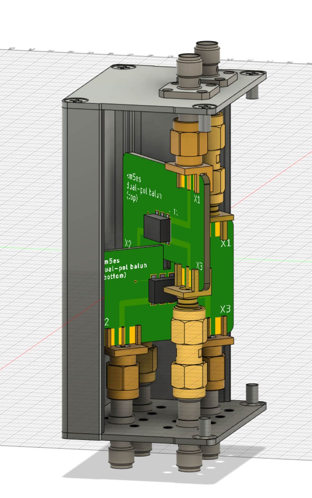

# RF-related files
This folder contains:
* MWO simulation files of the polarization switch - a network of RF switches, amplifiers, and filters that enables switching from linear X to linear Y polarization and then to circular polarization using the payload computer's GPIO.
* Eagle files for the polarization switch and a simple RF switch which is used for simply switching from linear X to linear Y polarization (for cross-polarization calibration only).
* Eagle, Inventor and Fusion360 files of the dual-pol balun candidates.

## Polarization switch
Below is a block diagram of the full polarization switch. Its purpose is to enable cross-polarization, co-polarization and circular polarization calibrations of the antenna under test. It will also facilitate multipath corrections and improve SNR by 10 dB bringing the total ouput power of the transmitter up to +20 dBm.

There should be three circuit boards: for a low-band (60 - 90 MHz), mid-band (120 - 150 MHz), and a high-band mode (190 - 250 MHz). [This](pol_switch.emp) file has the MWO simulations of the low-band version of the polarization switch. Here are the S-parameters (simulation only) of the low-band switch in circular polarization mode:

The BOM (not comprehensive right now, does not contain Mini Circuits components) is attached [here](ShopCart.csv). 

There is also a simpler version of the switch added [here](Switch-Eval/). This is simply an evaluation board of the [HSWA2-30DR+][switch] switch from Mini Circuits. This will only enable linear-X and linear-Y measurements. The boxes that I have chosen to house the PCBs are linked [here][hammond_box_large] and [here][hammond_box_small]. Fusion360 files soon to follow. This is what the boards look like right now (eval and full pol switch).

               

## Balun
This folder also contains 3D CAD models and Eagle PCB design files of the dual-pol balun. The balun is a vertically oriented dual-pol design using two separate PCBs with a 2:1 turns ratio [transformer][trans]. The box I am considering is linked [here][balun-box]. Here is what it looks like:

[hammond_box_large]: https://www.hammfg.com/part/1590Z062BK?referer=526
[hammond_box_small]: https://www.hammfg.com/part/1590Z061BK
[switch]: https://www.minicircuits.com/WebStore/dashboard.html?model=HSWA2-30DR%2B
[balun-box]: https://www.davantech.com/product/d1001433-electronic-project-box-52w38h80l/
[trans]: https://www.minicircuits.com/WebStore/dashboard.html?model=ADT2-1T%2B